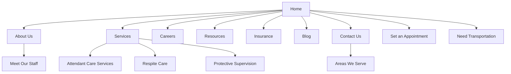
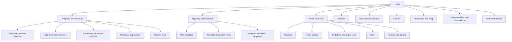
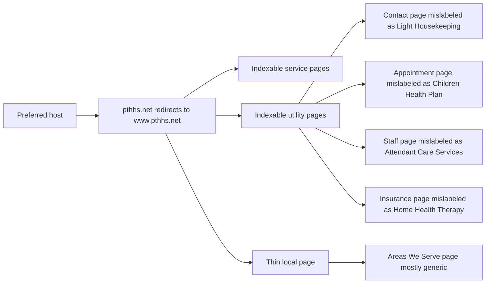
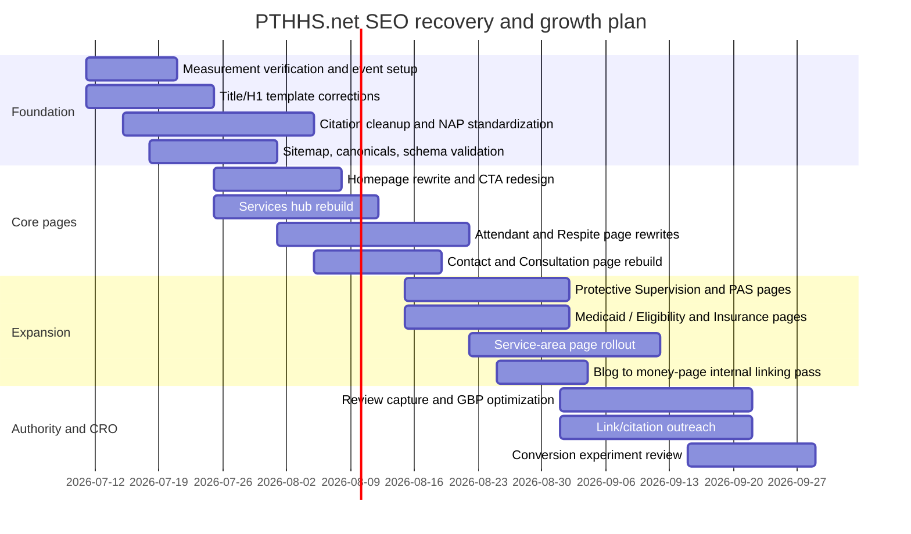

# SEO analysis and 90-day plan for PTHHS.net

## Executive summary

This report is a public-web SEO audit of PTHHS.net conducted on **July 10, 2026**. The site is indexable enough to appear in search, the root host redirects to the `www` version, and the business has real-world trust signals including a long operating history, an active Texas HHSC contract listing for PHC/FC/CAS, insurance participation, leadership bios, and visible testimonials. However, the site’s biggest SEO problems are not “Google can’t see the site.” They are **template-level relevance errors, weak intent targeting, thin local pages, unclear conversion paths, and likely measurement blind spots**. citeturn0view0turn10search0turn10search1turn5view0turn6view2

The most serious issue is that several important pages are optimized for the wrong topic. The contact page is labeled **“Light Housekeeping in Houston, Texas,”** the appointment page is labeled **“Children Health Plan in Houston, Texas,”** the staff page is labeled **“Attendant Care Services in Houston, Texas,”** the insurance page is labeled **“Home Health Therapy in Houston, Texas,”** the attendant-care page is labeled **“Elderly Care in Texas,”** and the respite page is labeled **“Elderly Home Care in Houston, Texas.”** These mismatches create search-intent confusion, dilute topical relevance, and risk keyword cannibalization across service, utility, and team pages. citeturn4view3turn4view4turn6view2turn5view0turn6view0turn6view1

The second major issue is **business-model ambiguity on the site itself**. Public evidence strongly suggests Primetime is not just a generic senior-care brand; it likely depends heavily on **Texas Medicaid and HHSC-linked personal attendant / community attendant / respite programs**, while also recruiting caregivers and supporting referrals. The site does not yet separate those audiences clearly into distinct SEO and conversion journeys. That means high-value organic visits may land on a page that does not answer the user’s real question: “Do I qualify?”, “Which insurance do you take?”, “Do you serve my area?”, or “How do I become a paid attendant?” citeturn10search0turn12search0turn12search1turn20search8turn5view0

The third major issue is **local authority leakage**. The website lists the current office as **11602 Burdine Street, Suite A, Houston, TX 77035**, but at least one public care directory still shows an older Bissonnet address. Citation inconsistency like that can weaken local trust and local pack performance because Google’s local systems rely on relevance, distance, and prominence, and profile accuracy matters for discoverability. citeturn4view3turn21search6turn21search8turn18search0turn18search1

The opportunity is substantial. Primetime already has assets that many local care businesses lack: years in business, a large attendant workforce, payer acceptance, real testimonials, identifiable leadership, and a clearly defined Greater Houston footprint. If the site is rebuilt around **program pages, service pages, eligibility pages, location pages, and tracked lead-generation events**, the domain should be able to capture much more non-branded demand and convert more of it into calls, forms, and referrals. Google’s own guidance continues to emphasize crawlable pages, people-first content, clear titles/headings, crawlable links, and mobile-friendly experiences. citeturn23search16turn23search1turn23search0turn17search3

### Highest-priority moves

| Priority | What to do | Why it matters |
|---|---|---|
| Critical | Fix page-title and H1 mismatches on service, contact, appointment, team, and insurance pages | Relevance and conversion are being diluted by obvious template mis-targeting. citeturn4view3turn4view4turn6view2turn5view0turn6view0turn6view1 |
| Critical | Split the site into distinct acquisition paths for **care seekers**, **Medicaid/HHSC program seekers**, **caregiver applicants**, and **referral partners** | The current structure mixes several intents on the same templates and weakens page usefulness. citeturn10search0turn12search0turn20search8turn0view0 |
| High | Add GA4 + Search Console confirmation, lead events, call-click tracking, and thank-you-page or event verification | Without usable measurement, you cannot prove what organic traffic generates leads. Google recommends event-based measurement and Search Console verification. citeturn15search1turn15search2turn22search0turn22search1 |
| High | Create dedicated pages for **Protective Supervision**, **Personal Attendant Services**, **Community Attendant Services**, **Eligibility**, and **Accepted Insurance / Plans** | These are visible business themes, but the site does not currently express them as strong search-intent landing pages. citeturn20search0turn20search1turn5view0turn12search0 |
| High | Clean up citations and business listings to the current Burdine address | Local consistency supports trust and local visibility. citeturn4view3turn21search6turn21search8turn18search0 |
| High | Rebuild thin utility pages or noindex them until rebuilt | Appointment, contact, and similar pages are indexable but currently mis-labeled or too thin. citeturn4view3turn4view4turn20search9turn3search6 |

## Scope, assumptions, and access

This audit uses **publicly accessible site pages, indexed search results, competitor SERPs, and official Google / Texas HHSC documentation**. I did **not** have direct access to Google Analytics 4, Google Search Console, Google Tag Manager, server logs, or the CMS. I also could not reliably fetch the site’s raw `robots.txt` and `sitemap.xml` contents with the available browsing tools, so those files remain unverified from firsthand inspection. Search Console remains the source of truth for indexing and rank-position diagnostics once owner access is available. citeturn15search20turn15search21

### Business-model assumptions

| Assumption | Why this is a reasonable assumption |
|---|---|
| Primetime’s core revenue likely includes **Texas Medicaid / HHSC-linked home-care programs** rather than only private-pay senior care | The site emphasizes attendant care, protective supervision, respite, insurance acceptance, and the company appears in HHSC contract and eligibility records for PHC/FC/CAS. citeturn10search0turn10search1turn12search0turn12search1 |
| A second growth goal is probably **caregiver / attendant recruitment** | The site has a dedicated Careers page, and leadership copy says the company supports over 500 PAS attendants. citeturn20search8turn6view2 |
| The business likely needs both **consumer leads** and **referral / reputation trust** | The site highlights insurance, staff, client reviews, contact forms, and community credibility signals. citeturn5view0turn6view3turn0view0 |
| Geographic focus is **Greater Houston plus surrounding counties / communities** | The homepage says Greater Houston; the About page lists Houston, Harris, Fort Bend, Montgomery, Galveston, Jefferson, and several communities. citeturn0view0turn7view0 |

### What owner access would materially improve

With GA4 and Search Console access, this report could replace directional rank/demand judgments with exact data for clicks, impressions, CTR, average position, indexed count, sitemap status, Core Web Vitals reports, and conversion rates by landing page. Google recommends verifying Search Console ownership, submitting sitemaps, and using event measurement to capture business-relevant behavior. citeturn15search1turn15search3turn15search20turn22search0turn22search1

## What the public-site audit shows

### Business-goal alignment

Public evidence suggests the site is trying to do four jobs at once: attract care seekers, explain program eligibility, recruit attendants, and establish organizational trust. The problem is not that these goals are wrong; it is that they are not cleanly separated into dedicated landing pages and CTAs. The top navigation mixes Services, Insurance, Resources, Careers, Contact, and an external transportation link, while the homepage repeats generic “Find Out More” messaging instead of routing each audience into a strong next step. citeturn0view0turn4view0

The homepage also contains duplicated hero/feature sections and repeated generic headlines such as **“True Healthcare For You and Your Family,” “Quality and Care,”** and **“Find Out More.”** That wastes high-value above-the-fold space that should instead answer: what exact programs are offered, who qualifies, what insurance is accepted, what areas are served, and what the user should do next. Google’s Search Essentials specifically recommends using the words people would use to find your content in prominent places such as titles, headings, alt text, and link text. citeturn0view0turn23search16

**Recommended business architecture**

- **Care seeker / family** funnel: service pages, insurance, areas served, reviews, consultation request.
- **Eligibility / Medicaid program** funnel: CAS, PAS, protective supervision, children under 21 / Medicaid process, accepted plans, “check eligibility.”
- **Referral partner** funnel: how referrals work, accepted plans, counties served, turnaround time, fax/contact.
- **Caregiver applicant** funnel: careers, requirements, benefits, application process, locations hiring.

That separation fits both the public site content and official HHSC program context. citeturn12search0turn12search1turn20search8turn5view0

### Measurement audit

I could not verify whether GA4, Google Tag Manager, or Search Console are installed because raw source access and account access were unavailable. From an audit standpoint, that means **measurement status is unknown**, and unknown measurement should be treated as an operating risk until confirmed. Google Analytics is event-based, and Google explicitly recommends setting up recommended and custom events for business outcomes like lead generation; Search Console ownership verification is required to access crawl, indexation, and performance data. citeturn15search1turn15search2turn22search0turn22search1

For this site, the minimum lead-tracking package should include:

| Event name | Trigger |
|---|---|
| `generate_lead` | Successful main contact-form submission |
| `generate_lead` with parameter `lead_type=appointment` | Appointment-form submission |
| `click_to_call` custom event | Tap/click on `tel:` links |
| `outbound_transport_click` custom event | Click to RidePrimetime external site |
| `caregiver_apply_start` custom event | Careers application start |
| `insurance_inquiry` custom event | Insurance / benefits contact CTA |
| `location_lookup` custom event | Click on maps / directions |
| `qualified_lead_closed` via Measurement Protocol or CRM sync | Offline lead converted to patient / referral / hire |

Google’s event references specifically recommend `generate_lead` for initial lead acquisition events like form submissions or requests, and Google’s Measurement Protocol can be used to augment web tagging with server-side or offline conversions. citeturn22search0turn22search6turn15search8

**What I would mark today**

| Audit item | Public status | Practical conclusion |
|---|---|---|
| GA4 property present | Unverified | Treat as missing until Tag Assistant or source inspection confirms |
| Search Console verified | Unverified | Treat as missing from an SEO-operations standpoint until confirmed |
| Phone-click tracking | Unverified | Must be implemented; calls are visibly central to the site’s CTA model. citeturn0view0turn4view3 |
| Form-submit tracking | Unverified | Must be implemented for contact and appointment flows. citeturn0view0turn4view4 |
| Thank-you page / success event | Unverified | Use dedicated success states or event callbacks |
| Cross-domain / outbound tracking to RidePrimetime | Unverified | Needed because the nav sends users to another domain. citeturn0view0 |

### Crawlability and indexation

The site root redirects from `https://pthhs.net/` to `https://www.pthhs.net/`, which is good because it establishes a preferred host. citeturn0view0

What is more concerning is the **quality of the pages that are indexable**. Public search results show that Google-like engines can find and index utility pages such as the privacy notice, contact page, appointment page, staff page, insurance page, client reviews page, and areas-served page. Indexability is not the problem; **indexing the wrong pages with the wrong keyword targets is the problem**. Utility pages are being allowed to compete in search even when their titles/H1s point at unrelated service terms. citeturn2search1turn3search8turn3search9turn3search5turn3search12turn2search11turn3search2

The following page set should be reviewed first:

| URL | Current issue | Action |
|---|---|---|
| `/home-care-contact-us` | Indexed, but labeled “Light Housekeeping” instead of Contact | Rebuild as conversion page or temporarily noindex until corrected. citeturn4view3 |
| `/home-care-set-an-appointment` | Indexed, but labeled “Children Health Plan” instead of appointment / consultation | Rebuild as “Request Consultation / Check Eligibility” page. citeturn4view4 |
| `/home-care-meet-our-staff` | Indexed, but labeled “Attendant Care Services,” risking service cannibalization | Rebuild around team/leadership intent; keep indexed only if rewritten. citeturn6view2 |
| `/home-care-insurance` | Indexed, but labeled “Home Health Therapy” while page is about accepted insurance | Rewrite page title/H1 and add plan-specific detail. citeturn5view0 |
| `/home-care-areas-we-serve` | Indexed but thin; says Greater Houston without unique city-level content | Expand or split into actual service-area landing pages. citeturn7view4 |
| `/privacy-notice` | Indexed legal page | Consider `noindex, follow` unless there is a legal reason to keep it indexed. citeturn2search1 |

I could not verify `robots.txt`, sitemap references, self-canonicals, or noindex tags directly. Because Google recommends submitting a sitemap in Search Console and optionally referencing it in `robots.txt`, I would treat **“verify sitemap existence and canonical policy”** as an early technical task. citeturn15search3turn15search9turn15search20

### Site architecture and internal linking

The current navigational architecture is shallow enough for major pages to be reachable in one or two clicks, which is good. The larger issue is **topic architecture**, not click depth. Services that deserve their own search presence are folded together or mislabeled. “Protective Supervision” is highlighted in navigation and on the homepage, but public search discovery points users mostly to mixed service pages instead of a strong dedicated landing page. citeturn0view0turn20search0turn20search1

The homepage and interior pages also rely heavily on weak anchor text such as **“Find Out More,” “Click Here,”** and generic service-card labels. Google recommends descriptive link text, and descriptive internal links also help reinforce topical relevance across the site. citeturn0view0turn23search16

**Current high-level site map**



The navigation above is visible on the site across core pages. citeturn0view0turn4view0turn4view2

**Recommended information architecture**



That structure aligns with the way people actually search and with Google’s advice to create useful, clearly described content with crawlable internal links. citeturn23search16turn23search2

### Page quality and on-page SEO

The site has real trust material, but important pages are still weakened by thin copy, template remnants, and mismatched optimization. The About page is a strong trust-building asset overall, yet it contains a visible **“Content Coming Soon…”** section even though more content follows below it, which signals unfinished templating. The Areas We Serve page is too generic to rank well for city- or county-specific intent. The homepage contains strong social proof, but the trust signals are not organized into a decisive conversion block above the fold. citeturn7view0turn5view2turn0view0

The biggest on-page problem remains title/H1 mismatch:

| Page | Current search/title targeting | What it should target |
|---|---|---|
| Home | “Home Health Agency / In-Home Support / Home Care” | Clear Houston home care + attendant services + brand targeting. citeturn2search0turn0view0 |
| Services | “Senior Home Care” | Service hub for home care, attendant care, respite, supervision. citeturn3search3turn4view0 |
| Attendant Care | H1 says “Elderly Care in Texas” | Attendant Care Services in Houston / Greater Houston. citeturn6view0 |
| Respite | H1 says “Elderly Home Care in Houston, Texas” | Respite Care in Houston. citeturn6view1 |
| Insurance | H1 says “Home Health Therapy in Houston, Texas” | Accepted Insurance for Home Care in Houston. citeturn5view0 |
| Contact | H1 says “Light Housekeeping in Houston, Texas” | Contact Primetime Home Health Services. citeturn4view3 |
| Appointment | H1 says “Children Health Plan in Houston, Texas” | Request Consultation / Check Eligibility. citeturn4view4 |
| Meet Our Staff | H1 says “Attendant Care Services in Houston, Texas” | Meet the Leadership Team. citeturn6view2 |

There is also a strategic content gap. The blog has posts published in late 2024 and early 2025, which shows content activity, but most high-value questions still deserve permanent conversion-adjacent pages rather than only blog coverage: qualification, Medicaid process, what protective supervision means, how respite works, which insurance plans are accepted, what counties are served, and how to start care. citeturn2search3turn9search21

### Mobile experience, structured data, and local authority

Google uses mobile-first indexing, and Google strongly recommends achieving good Core Web Vitals. I was not able to pull live PageSpeed Insight scores for PTHHS.net, but the site’s repeated image-heavy blocks, duplicated homepage sections, and template-heavy layouts make performance optimization a likely opportunity—especially on mobile. citeturn23search0turn17search3turn0view0

Structured data is another likely missed opportunity. I could not confirm existing schema from the public render, so implementation should be tested with Google’s Rich Results Test. At minimum, the site should have `LocalBusiness`, `Organization`, and `BreadcrumbList` markup, with `Article` markup on blog posts. Google recommends using the most specific local-business subtype that makes sense and validating structured data with the Rich Results Test. citeturn16search0turn16search1turn16search2turn16search6

Local authority is mixed. On the positive side, public branded references exist on LinkedIn, Facebook, CareAvailability, CareListings, and a Houston home-care directory that references Texas HHS public records. On the negative side, at least one high-visibility directory still shows an older address, which is exactly the kind of citation inconsistency that should be cleaned up. citeturn21search4turn21search2turn21search8turn21search6turn9search23

**Crawl/index issue visualization**



The redirect and the mislabeled utility pages are visible in the public page snapshots and search results. citeturn0view0turn4view3turn4view4turn6view2turn5view0turn7view4

## Keyword demand, intent, and SERP competition

The table below uses **directional volume bands** rather than exact monthly numbers, because exact Google search volume requires owner access to Google Ads Keyword Planner or a paid keyword database. Rank observations are from public live search snapshots on July 10, 2026; once Search Console access is available, replace these with actual average position and query-level click data. Google Search Console is the correct long-term source for that validation. citeturn15search20turn15search21

### Keyword-to-page map

| Keyword cluster | Monthly volume band | Intent | Public current rank snapshot | Business value | Best target page | Recommendation |
|---|---:|---|---|---|---|---|
| home care houston tx | High | Commercial / local | Not observed in visible top snapshot; competitors like All About Home Care and others are more prominent. citeturn14search0turn11search0 | High | Home | Rebuild homepage around Houston home care + attendant services + insurance + consultation CTA |
| home health agency houston tx | Medium | Commercial / local | Not observed in visible top snapshot; stronger competitors and hospitals appear. citeturn14search3turn14search7turn14search24 | Medium | About or Home | Decide whether this is a true primary term; if yes, create a better service-led page, not just About |
| attendant care services houston tx | Low to medium | Commercial / local | PTHHS appears visibly for this query family. citeturn14search2turn12search8 | High | Attendant Care page | Protect and improve this position with corrected H1/title, eligibility details, FAQs, and city/service-area relevance |
| respite care houston tx | Medium | Commercial / local | Not observed in visible top snapshot; non-profit, assisted-living, and franchise results dominate. citeturn14search1turn14search11turn14search12 | High | Respite Care page | Rewrite around local caregiver-relief intent and add service area, care scenarios, and conversion proof |
| protective supervision houston tx | Low | Commercial / program-intent | No strong dedicated PTHHS landing page surfaced; term is buried in mixed pages. citeturn20search0turn20search1 | High | New Protective Supervision page | Create a dedicated page with who it helps, program context, eligibility pathway, and FAQs |
| personal attendant services houston | Low to medium | Commercial / program-intent | No strong dedicated PTHHS page surfaced; competitors explicitly target PAS. citeturn12search12turn12search16turn14search9 | High | New Personal Attendant Services page | Create a dedicated PAS page; do not force PAS to live only inside broader attendant copy |
| community attendant services houston | Low to medium | Informational → commercial | Official HHSC and informational sources dominate. citeturn12search0turn14search17 | High | New CAS / Eligibility page | Build a page that answers the official-program question, then hands off to Primetime as provider |
| medicaid home care houston | Medium | Informational → commercial | Competitors like Newport are more explicit about Medicaid-covered care. citeturn12search7turn14search9 | High | New Medicaid / Eligibility page | Build a focused “Medicaid home care in Greater Houston” page tied to plans and programs you actually support |
| accepted insurance home care houston | Low | Transactional / validation | Existing insurance page is indexed but mislabeled. citeturn5view0 | Medium to high | Insurance page | Keep indexed, but rename and expand by plan and payer FAQ |
| primetime home health services | Branded | Navigational | Branded queries already surface the site and profiles. citeturn21search0turn21search2turn21search4 | Medium | Home / GBP / socials | Defend branded trust with consistent NAP, review management, and `sameAs` schema |

### Competitor and SERP gap matrix

| Competitor / SERP type | What they are doing better in public search | Gap for PTHHS | Recommended response |
|---|---|---|---|
| All About Home Care | Ranks strongly for generic Houston home-health/home-care terms and has a fuller portal/information structure. citeturn14search0turn11search4 | PTHHS homepage is too generic and not service-program-specific enough | Rebuild homepage and services hub for stronger commercial-intent match |
| Harbor Home Care | Clear local proposition and service blocks including respite. citeturn11search0 | PTHHS service pages are mislabeled and less differentiated | Add stronger service-page copy, proof, and local intent formatting |
| Accessible Home Health Care | Uses authority signals like CMS 5-star language and awards. citeturn14search6 | PTHHS underuses trust/credential copy above the fold | Surface licensure, years in business, attendant count, accepted plans, and testimonial proof |
| Newport Home Health | Explicitly targets Medicaid caregivers, personal assistance, respite, and Houston location terms. citeturn14search9turn12search7 | PTHHS does not yet own Medicaid / PAS intent cleanly | Build Medicaid, PAS, and eligibility pages |
| Aleris Home Health | Long-form local content, insurance mention, FAQs, multiple service areas. citeturn8search7 | PTHHS local pages are thin and under-explanatory | Expand service-area and insurance content; add FAQs and care scenarios |
| HHSC informational pages | Dominate for CAS/program terms with official definitions and eligibility context. citeturn12search0turn12search1 | PTHHS is trying to rank for program-adjacent terms without answering the official-program question | Create “what is CAS / who qualifies / how Primetime helps” content rather than only sales copy |

## Page-level briefs and exact implementation assets

### Page-by-page revision briefs

| Page | Keep / rebuild | What to change |
|---|---|---|
| Home | Rebuild | Replace repeated hero blocks with one primary proposition: “Home care and personal attendant services in Greater Houston.” Add three audience CTAs: **Check Eligibility**, **Request Consultation**, **Apply as a Caregiver**. Move insurance logos and service areas above the fold. Add one proof strip: “Serving Greater Houston since 1999,” “500+ PAS attendants,” “Accepted plans,” “Call 713-977-7721.” Evidence of current duplication and proof material already exists on the site. citeturn0view0turn6view2 |
| Services hub | Rebuild | Turn the page into a hub rather than a mixed article. Create cards and summaries for Attendant Care, Personal Attendant Services, Community Attendant Services, Protective Supervision, and Respite. Current page lumps multiple intents together. citeturn4view0turn20search1 |
| Attendant Care | Keep, but rewrite | Fix title/H1. Add “Who this helps,” “Tasks we help with,” “How attendant services work,” “Programs and insurance,” “Family caregiver option,” “Areas served,” “FAQ,” and a strong CTA. The current page has relevant raw material but points at “Elderly Care” instead of the actual service name. citeturn6view0turn7view2 |
| Respite Care | Keep, but localize and strengthen | Fix title/H1. Keep FAQ section, but add Houston-area trust, caregiver scenarios, duration options, response time, who respite is for, and insurance/program notes. The page already has useful FAQ depth. citeturn6view1turn4view1 |
| Protective Supervision | New page | Promote what is currently buried in mixed service text into its own URL. Focus on safety monitoring, dementia / disability use cases, how it differs from general companionship, and eligibility pathways. citeturn20search0turn20search1 |
| Insurance | Keep, but expand | Fix title/H1. Add plain-language sections for each accepted payer or plan family, whether services are Medicaid / plan dependent, and what to prepare before calling. citeturn5view0 |
| Areas We Serve | Rebuild | Replace generic “Greater Houston Area” copy with real city/county sections for areas truly staffed. Use unique copy, travel/service notes, and nearby landmarks only where allowed by Google’s business guidelines. citeturn5view2turn7view0turn18search3 |
| Contact | Rebuild | Fix title/H1. Add program-specific inquiry choices, office hours, map, family/referral/caregiver routing, and response-time expectation. Current page is usable but mislabeled. citeturn4view3 |
| Appointment | Rebuild | Convert into **Request Consultation / Check Eligibility**. Replace the current mislabeled template with a short intake form that captures care type, insurance, county/city, patient age, and urgency. citeturn4view4 |
| Meet Our Staff | Keep, but de-optimize from service intent | Fix page title/H1 and add `Person`-style structured details if desired, but do not let this page target commercial service keywords. citeturn6view2 |

### Recommended title, meta description, and H1 replacements

| URL | Title tag | Meta description | H1 |
|---|---|---|---|
| `/` | Home Care and Personal Attendant Services in Houston, TX \| Primetime Home Health Services | Compassionate home care in Greater Houston, including attendant care, respite care, protective supervision, and Medicaid-supported programs. Call 713-977-7721. | Home Care and Personal Attendant Services in Houston, Texas |
| `/home-care-services` | Home Care Services in Houston, TX \| Attendant Care, Respite, Protective Supervision | Explore home care services from Primetime in Greater Houston, including attendant care, respite care, protective supervision, and support for daily living. | Home Care Services in Houston, Texas |
| `/home-care-services/attendant-care-services` | Attendant Care Services in Houston, TX \| Primetime Home Health Services | Trained attendants help with bathing, dressing, mobility, grooming, meals, and daily routines. Serving Greater Houston families. | Attendant Care Services in Houston, Texas |
| `/home-care-services/respite-care` | Respite Care in Houston, TX \| Relief for Family Caregivers | Temporary in-home respite care for seniors and adults with disabilities. Get trusted relief for family caregivers in Greater Houston. | Respite Care in Houston, Texas |
| `/home-care-insurance` | Accepted Insurance for Home Care in Houston, TX | See accepted insurance and Medicaid-related plan partners for home care services in Greater Houston. | Accepted Insurance for Home Care in Houston, Texas |
| `/home-care-contact-us` | Contact Primetime Home Health Services \| Houston, TX | Call, email, or message Primetime Home Health Services for care questions, referral support, or caregiver inquiries. | Contact Primetime Home Health Services |
| `/home-care-set-an-appointment` | Request a Home Care Consultation in Houston, TX | Start with a consultation to discuss care needs, eligibility, service areas, and accepted plans. | Request a Home Care Consultation in Houston, Texas |
| `/home-care-meet-our-staff` | Meet Our Home Care Leadership Team \| Primetime Houston | Learn about the leadership team behind Primetime Home Health Services in Houston. | Meet Our Leadership Team |
| `/home-care-areas-we-serve` | Home Care Service Areas in Greater Houston \| Primetime | See the Greater Houston communities Primetime serves for home care, attendant services, and respite care. | Home Care Service Areas in Greater Houston |

### Alt-text replacements

The site currently uses many generic image labels in rendered output. Replace decorative or repetitive alt text with either empty alt attributes for purely decorative imagery or descriptive, user-helpful text for meaningful images. Google advises using descriptive alt text where appropriate. citeturn23search16turn23search22

Recommended examples:

- `Caregiver assisting an adult client with walking support at home in Houston`
- `Family caregiver speaking with Primetime care coordinator`
- `Home care consultation with caregiver and elderly client`
- `Primetime Home Health Services office in Houston`
- `Insurance partner logos accepted by Primetime Home Health Services`

### Structured data snippet

Use JSON-LD and validate it with Google’s Rich Results Test. Google supports Organization, LocalBusiness, Breadcrumb, and Article-appropriate markup where relevant. citeturn16search0turn16search1turn16search2turn16search6

```json
{
  "@context": "https://schema.org",
  "@type": "LocalBusiness",
  "name": "Primetime Home Health Services, Inc.",
  "url": "https://www.pthhs.net/",
  "telephone": "+1-713-977-7721",
  "email": "pas@pthhs.net",
  "address": {
    "@type": "PostalAddress",
    "streetAddress": "11602 Burdine Street, Suite A",
    "addressLocality": "Houston",
    "addressRegion": "TX",
    "postalCode": "77035",
    "addressCountry": "US"
  },
  "areaServed": [
    "Houston",
    "Harris County",
    "Fort Bend County",
    "Montgomery County",
    "Galveston County"
  ],
  "sameAs": [
    "https://www.facebook.com/primetimehomehealth/",
    "https://www.linkedin.com/company/pthhs",
    "https://www.instagram.com/primetimehomehealthservices/"
  ]
}
```

The address, brand, and social-profile references above are publicly visible across the site and third-party profiles. citeturn4view3turn21search2turn21search4turn9search15

A standard breadcrumb implementation should also be added on all interior templates:

```json
{
  "@context": "https://schema.org",
  "@type": "BreadcrumbList",
  "itemListElement": [
    {
      "@type": "ListItem",
      "position": 1,
      "name": "Home",
      "item": "https://www.pthhs.net/"
    },
    {
      "@type": "ListItem",
      "position": 2,
      "name": "Services",
      "item": "https://www.pthhs.net/home-care-services"
    },
    {
      "@type": "ListItem",
      "position": 3,
      "name": "Attendant Care Services",
      "item": "https://www.pthhs.net/home-care-services/attendant-care-services"
    }
  ]
}
```

### Developer task list

| Task | Owner |
|---|---|
| Map every template to the correct title tag, meta description, and H1 rules | SEO + developer |
| Remove duplicated homepage hero/content blocks | Developer |
| Add self-referencing canonicals on all indexable pages | Developer |
| Verify or create XML sitemap, submit in Search Console, and reference in `robots.txt` | Developer + SEO |
| Add `LocalBusiness`, `Organization`, `BreadcrumbList`, and `Article` schema where appropriate | Developer |
| Create dedicated templates for service pages, eligibility pages, and city/county pages | Developer + content |
| Convert hero and service images to modern formats, lazy-load below the fold, preload LCP image | Developer |
| Track `generate_lead`, phone clicks, external transport clicks, and offline closed leads | Developer + analytics |
| Add concise, descriptive internal links instead of “Click Here” / “Find Out More” | Content + SEO |
| Standardize NAP everywhere, then update external citations | Marketing / operations |

## Prioritized 90-day roadmap

### Prioritized issue list

| Issue | Evidence | Impact | Recommendation | Priority | Effort | Owner | KPI | Verification |
|---|---|---|---|---|---|---|---|---|
| Wrong title/H1 targeting on major pages | Contact, appointment, staff, insurance, attendant, and respite pages are all mismatched. citeturn4view3turn4view4turn6view2turn5view0turn6view0turn6view1 | Relevance loss, cannibalization, lower CTR, user confusion | Correct template map for title/meta/H1 across all high-value pages | Critical | Medium | SEO + developer | Impressions, CTR, rankings, leads | Re-crawl pages, inspect SERP titles, monitor GSC |
| Business intents are mixed on the same pages | Services, insurance, careers, apppointment, resources, and transport all compete inside one architecture. citeturn0view0turn20search8turn5view0 | Lower conversion rate and weaker topical authority | Split into care-seeker, eligibility, referral, and caregiver funnels | Critical | Large | Strategy + content + developer | Organic conversions by landing page | GA4 funnel + GSC landing-page changes |
| Thin / mis-targeted utility pages are indexed | Appointment, contact, privacy, areas, and staff pages are indexable despite quality issues. citeturn2search1turn4view3turn4view4turn7view4turn6view2 | Wasted crawl budget, cannibalization, poor SERP quality | Rebuild or noindex thin utility pages until fixed | High | Medium | SEO + developer | Indexed URL quality, CTR | URL Inspection + GSC Pages report |
| Missing dedicated pages for PAS / CAS / Protective Supervision / Medicaid intent | Terms appear, but not as strong dedicated pages. citeturn20search0turn20search1turn12search0 | Lost non-branded demand | Create dedicated pages with FAQs and next-step CTAs | High | Large | Content + SEO | Impressions for non-branded program terms | GSC query growth |
| Citation inconsistency on address | Site uses Burdine; CareListings shows older Bissonnet listing. citeturn4view3turn21search6turn21search8 | Local trust and local ranking risk | Update major data aggregators and key directories to current NAP | High | Medium | Operations / local SEO | Local impressions, calls, directions | Manual citation audit + GBP insights |
| Measurement cannot be confirmed | No account access; key lead events unverified. citeturn15search1turn22search0turn22search1 | Can’t attribute organic ROI | Implement GA4 + GSC + event tracking package | High | Medium | Analytics + developer | Lead volume by source / page | Realtime, DebugView, test submissions |
| Homepage wastes prime space with duplicated/generic messaging | Repeated hero/feature blocks and generic CTAs on homepage. citeturn0view0turn7view3 | Lower engagement and weaker value communication | Replace with one strong proposition and three intent-based CTAs | High | Medium | Content + design + dev | Bounce/engagement, lead rate | GA4 landing page comparison |
| Areas page is too generic | “Greater Houston Area” copy without city-level detail. citeturn7view4turn7view0 | Weak local relevance | Build real city/county pages only where legitimately served | High | Large | Content + local SEO | Local non-branded impressions | GSC page/query report |
| Weak descriptive internal linking | “Find Out More” and “Click Here” repeated. citeturn0view0turn23search16 | Weak internal topical reinforcement | Replace with descriptive anchors to service/eligibility pages | Medium | Small | Content | Internal click distribution, rankings | Crawl and anchor-text export |
| Schema and sitemap status unverified | Could not confirm markup or sitemap directly. Google recommends sitemap submission and schema validation. citeturn15search3turn16search6 | Lower technical clarity | Validate and implement schema plus sitemap submission | Medium | Medium | Developer | Valid items, crawl discovery | Rich Results Test + Search Console |

### Conversion experiments

A good 90-day SEO plan should improve not just rankings, but also lead efficiency. Based on the current site, the highest-value experiments are:

| Experiment | Hypothesis | Success metric |
|---|---|---|
| Replace generic homepage CTA with three intent CTAs: **Check Eligibility**, **Request Consultation**, **Apply as a Caregiver** | Visitors will self-sort faster and convert at a higher rate | Increase in organic lead rate and reduced pogo-sticking |
| Add sticky mobile call / consultation bar | Call-first users will convert faster on mobile | Call-click rate from organic landing pages |
| Add “We accept…” insurance block above the fold on service pages | Insurance confidence reduces friction | Form completion rate |
| Add response-time promise | “We respond same business day” increases lead confidence | Lead submission rate |
| Add care-scenario blocks on Respite and Attendant pages | Visitors need concrete use cases, not generic promises | Scroll depth, CTA click rate |
| Build a two-step qualification form | Short first step reduces abandonment | Form-start to form-submit rate |

### Timeline



### Owner-only checks to run immediately

Once access is available, run these in the first week:

| Tool | Exact check |
|---|---|
| Search Console | Performance report → Pages: `/`, `/home-care-services`, `/home-care-services/attendant-care-services`, `/home-care-services/respite-care`, `/home-care-contact-us`, `/home-care-set-an-appointment`; compare last 16 months vs previous period |
| Search Console | Queries regex contains: `attendant|respite|protective|medicaid|home care|houston` |
| Search Console | URL Inspection on all priority pages to confirm canonical, index status, and discovered vs submitted URLs |
| Search Console | Sitemaps report for XML sitemap submission status |
| GA4 | Landing page report with organic traffic and conversions for consultation, contact, phone click, and caregiver starts |
| GA4 Realtime / DebugView | Test form submit, phone click, and outbound RidePrimetime click |
| Tag Assistant | Verify only one Google tag fires and events are not duplicated |
| PageSpeed Insights | Mobile tests for home, services hub, attendant page, respite page, contact page |
| Rich Results Test | Validate schema on home, services, and blog post templates |
| Screaming Frog | Crawl plus near-duplicate title/H1 report, orphan-page report with GSC integration, thin-page list, image-weight report |

Google’s documentation supports Search Console ownership, sitemap submission, event setup, and validation workflows for exactly these kinds of checks. citeturn15search1turn15search3turn15search21turn22search1turn22search16turn17search1turn16search6

The practical outcome target for the first 90 days is straightforward: **clean relevance signals, stronger service and eligibility pages, trustworthy local data, and measurable lead generation**. If those are executed well, PTHHS.net should be in a much stronger position to grow both non-branded search visibility and actual consultations, referrals, and caregiver applications. citeturn23search16turn23search1turn18search0turn22search0